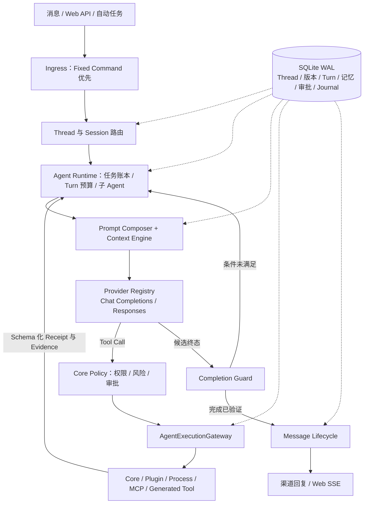

## 项目介绍

`karin`（卡琳）是一款灵活、现代、极易扩展的 Node.js 插件化应用框架，专为开发者打造，助你轻松构建属于自己的高效工具链和自动化服务。

> 🎉 **重要更新**：感谢 [valqelyan](https://github.com/valqelyan) 的慷慨转让，从 2.0 版本开始，我们将正式使用 `karin` 作为 npm 包名！
> **Important Update**: Thanks to [valqelyan](https://github.com/valqelyan)'s generous transfer, starting from version 2.0, we will officially use `karin` as our npm package name!

✨ **主要特性**：

- 插件化架构，支持本地 TypeScript 源码运行、热重载和结构化 Tool
- 一行命令即可初始化项目，快速上手
- 丰富的 Web UI（基于 React + HeroUI），颜值与功能并存
- 支持 OneBot、多渠道适配、自动任务、渲染、Redis 与 SQLite
- 内置可审计的 Agent Harness，可接入 OpenAI-compatible Provider 和 MCP
- 社区活跃，持续更新，文档完善

> 🦄 让开发变得像魔法一样有趣！

## Karin Agent Harness

Karin Agent 不是单纯的模型调用封装。外部模型只负责推理和 Tool Calling；Core 中的 Harness
负责命令优先路由、Prompt 治理、任务账本、权限审批、Tool 执行、真实回执、长期记忆、重启恢复
和最终消息投递。



Prompt 不是一段可任意覆盖的字符串，而是按固定优先级组合：

```text
Harness Kernel
  > AGENT.md 版本
    > 人物预设版本
      > Skill 索引与会话摘要
        > 作用域长期记忆
          > 当前任务与用户消息
```

主要组成：

- **Runtime**：驱动模型与 Tool 多轮交互，控制执行预算、并行调用、中断和子 Agent。
- **Prompt 与 Context**：组合不可覆盖的 Kernel、版本化 `AGENT.md`、人物预设、Skill 索引、
  会话摘要和作用域记忆；上下文达到软/硬阈值时生成有父版本的可追溯摘要。
- **Provider Registry**：统一适配 Chat Completions 与 Responses 协议，声明 stream、Tool、
  structured output 和 vision 能力，支持会话级模型选择、重试与 fallback。
- **Policy 与 Execution Gateway**：先由 Core Policy 决定允许、询问或拒绝，再由 Gateway 选择
  Core、兼容插件、进程、MCP 或 Generated Tool 执行器，并统一处理 Schema、超时、脱敏和 Receipt。
- **Task 与 Completion Guard**：以持久化任务清单驱动复杂请求，并通过 Tool Receipt 与完成条件
  检查防止未执行完成就返回成功。
- **Memory 与 Learning**：长期记忆先按 global/user/group 隔离，再用 FTS5 或词项相关度召回；
  用户纠正会取代同键旧值，后台反思只能通过候选评测晋升。
- **Persistence 与 Recovery**：SQLite 保存 Thread 版本锁、Turn、任务、记忆来源、审批、Receipt
  和事件 Journal；重启后只接管可确认安全的操作，未知非幂等副作用不会自动重放。
- **可扩展能力**：内置版本化 Skill、MCP Client、纯计算 Generated Tool、自动任务、子 Agent 和
  可审计的改进/恢复候选流程。

Harness 的关键边界：

- Fixed Command 始终先于 Agent，Tool 不会通过伪造消息递归调用命令处理器。
- `AGENT.md` 是全局工作章程；人物预设只描述身份与表达；长期记忆只保存事实和偏好。
- 人物、记忆、Skill、插件 Hook 和 Tool 输出都不能提升权限或覆盖审批结果。
- 行动完成必须有真实 Tool Receipt；模型自行声称“完成”不构成证据。
- `legacy-inline` 仅用于插件兼容；严格模式会拒绝它。“进程隔离”不会被标注为安全沙箱。

Agent 默认关闭。完整架构、配置、审批策略、数据迁移与运维说明见
[Karin Agent 架构与运维](./docs/karin-agent.md)。

### 启用 Agent

1. 启动 Core 和 WebUI，进入 Web 控制台的 Agent 配置页。
2. 添加 Provider、模型和 API Key，完成连接测试后启用 Agent。
3. 在“指令与人物”中维护 `AGENT.md` 和人物预设；新 Thread 会锁定当时的版本。
4. 对话页可使用 `/model` 和 `/persona` 查看或切换当前 Thread 的模型与人物。

也可以直接编辑运行目录中的 `@karinjs/config/agent.json`。配置版本为 v10，旧版配置会向前
迁移；API Key 和 MCP 凭据不得提交到 Git，MCP Secret 应使用 `${ENV_NAME}` 引用环境变量。

主要运行时文件：

| 文件或目录                        | 用途                                                 |
| --------------------------------- | ---------------------------------------------------- |
| `@karinjs/config/agent.json`      | Provider、路由、预算、Policy、Memory、MCP 与执行模式 |
| `@karinjs/config/AGENT.md`        | 全局工作章程；32 KiB 上限，保存为不可变版本          |
| `@karinjs/data/db/agent/agent.db` | Agent SQLite 数据库与 WAL Journal                    |
| `@karinjs/data/agent/skills/`     | 版本化 Skill 文档及支持文件                          |

## 🚀 稳定长期维护

自 `1.8.0` 版本起，Karin 已进入**稳定长期维护阶段**。我们承诺持续修复 bug、优化体验，并欢迎社区力量共同完善生态。

## 快速开始

[📚 查看最新文档](https://karinjs.com/)

一键初始化：`pnpm create karin`

> 当前文档可能存在滞后性，欢迎加入交流群（850541480）一起玩耍、提建议！

### 基本运行方式

运行环境要求：

- Node.js 20 或更高版本
- pnpm 9

首次安装依赖：

```bash
pnpm install --frozen-lockfile
```

开发运行 Core：

```bash
pnpm dev
```

WebUI 开发模式需要另开一个终端：

```bash
pnpm dev:web
```

生产构建与启动：

```bash
pnpm build
pnpm app
```

默认 WebUI 地址由 `.env` 中的 `HTTP_HOST`、`HTTP_PORT` 决定。默认端口为
`7777`，本机访问地址通常为 `http://127.0.0.1:7777/web`。

常用验证命令：

```bash
pnpm test
pnpm exec vitest run tests/agent
pnpm exec eslint "packages/**/*.ts"
pnpm build
```

## 仓库结构

Karin 使用 pnpm workspace 管理多个发布包：

```text
packages/
├─ core/          node-karin 核心运行时、Agent、HTTP/WebSocket 与数据访问
├─ web/           React 19 + Vite Web 管理界面
├─ cli-Internal/  核心 CLI 的 TypeScript 实现
├─ cli/           已发布 CLI 的轻量转发入口
├─ create-karin/  项目与插件脚手架
├─ onebot/        OneBot API、事件、消息、HTTP 与 WebSocket 实现
├─ types/         独立类型声明包
├─ pm2/           PM2 运行支持
└─ test/          示例运行环境

tests/agent/      Agent Harness、Provider、策略、持久化和轨迹回归测试
scripts/          仓库维护脚本
```

生产构建输出到各包的 `dist/`；WebUI 会构建到 `packages/core/dist/web/`。插件模板
`packages/karin-plugin-js/` 与 `packages/karin-plugin-ts/` 不参与根 workspace 构建。

### Git 插件免构建运行

Git 插件可以直接克隆到项目的 `plugins` 目录。Karin 会优先运行插件声明的
TypeScript 源码，不要求先执行插件的 build：

```bash
git clone <插件仓库地址> plugins/karin-plugin-example
pnpm install
pnpm app
```

插件存在额外依赖时仍需执行依赖安装，但无需生成 `lib` 或 `dist`。运行期间修改
本地 Git 插件的 `.ts`、`.tsx`、`.js`、`.mjs`、`.cjs`、`.mts` 或 `.cts`
应用文件会触发热重载。

TypeScript 插件建议在 `package.json` 中声明源码入口：

```json
{
  "karin": {
    "main": "src/index.ts",
    "ts-apps": ["src/apps"]
  }
}
```

没有 `ts-apps` 的旧插件会继续读取原有 `karin.apps`，NPM 插件仍使用其发布的构建产物。

### 命令帮助

向机器人发送 `#帮助`，Karin 会扫描当前已经加载的全部正则命令，按来源插件分类，
显示命令正则、功能描述和特殊权限。插件热更新后，帮助内容会实时反映新的命令列表。

插件作者可以为命令填写简短描述：

```ts
export const status = karin.command(/^#状态$/, showStatus, {
  name: '运行状态',
  description: '查看机器人和运行环境状态',
})
```

## 温馨提示

> Karin 现已稳定，放心食用！遇到问题欢迎提 Issue 或加群讨论，我们会持续优化。

## 文档站说明

我们提供多个文档站点供您访问，解决可能出现的访问困难：

- **主文档站**: [https://karinjs.com](https://karinjs.com)
- **镜像站点**:
  - [自建镜像(雾里)](https://github.com/shiwuliya): [https://karin.wuliya.cn](https://karin.wuliya.cn)
  - [Vercel 镜像(憨憨)](https://github.com/hanhan258): [https://karin.hanhanz.top](https://karin.hanhanz.top)
  - Deno 镜像: [https://karin.deno.dev](https://karin.deno.dev)
  - [自建CDN镜像(ikechan8370)](https://github.com/ikechan8370): [https://karin.chaite.cloud](https://karin.chaite.cloud)

> 💡 主文档站托管在 GitHub 上，如访问不畅，推荐使用 `ikechan8370` 镜像站

## 鸣谢

- webui: [bietiaop](https://github.com/bietiaop)
- docs: [ikenxuan](https://github.com/ikenxuan)
- name: [fuqiuluo](https://github.com/fuqiuluo)
- package-name: [valqelyan](https://github.com/valqelyan)

### 特别感谢 / Special Thanks

感谢 [valqelyan](https://github.com/valqelyan) 将 `karin` npm 包名转让给我们！这位伟大的开发者将他们闲置的包名无偿转让，让 Karin 项目能够在 2.0 版本正式启用 `karin` 这个更直观的包名。

Thanks to [valqelyan](https://github.com/valqelyan) for transferring the `karin` npm package name to us! This amazing developer generously transferred their unused package name, allowing the Karin project to officially use the more intuitive `karin` package name starting from version 2.0.

相关讨论请见：[valqelyan/karin#6](https://github.com/valqelyan/karin/issues/6)

> 🧙‍♂️ 感谢四位大佬的魔法加持！

### 贡献者

> 🌟 星光闪烁，你们的智慧如同璀璨的夜空。感谢所有为 **Karin** 做出贡献的人！

[](https://github.com/KarinJS/Karin/graphs/contributors)


---

🎉 **加入我们，让 Karin 成为你开发路上的贴心伙伴！**

## 常见问题

- 文档没看懂？[点我提问](https://github.com/KarinJS/Karin/issues) 或加群 850541480
- 插件不会写？欢迎参考[插件开发文档](https://karinjs.com/guide/index/)
- 遇到 bug？大胆提 Issue，我们超快响应！

## 如何参与贡献（PR）

1. Fork 本仓库，创建你的分支
2. 提交你的更改，附上简要说明
3. 发起 Pull Request，耐心等待 Review
4. 你的名字将出现在贡献者列表，收获一份开源荣誉！

> 💡 欢迎任何形式的贡献，无论是代码、文档、建议还是灵感！

## Issue 指南

- 提交前请先搜索是否有类似问题
- 尽量提供详细的复现步骤、环境信息和截图
- 标题简明扼要，正文描述清晰
- 遇到安全相关问题请私信维护者

## 开源协议

本项目基于 [MIT License](./LICENSE) 开源，欢迎自由使用、修改和分发。

> 📢 记得给个 Star 支持我们，你的支持是我们最大的动力！

## 更新日志

我们定期发布更新，查看 [CHANGELOG](https://github.com/KarinJS/Karin/releases) 了解最新变化。
